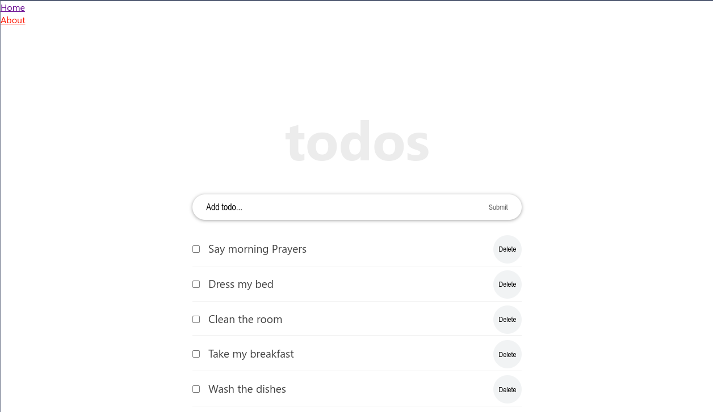

# Todo-App-RX

> This tutorial, divided into several parts, is very comprehensive, and covers all main concepts about React, from the very basics to some intermediate topics.

## Preview

## Tutorial Guide
- The tutorial is organized in the following sections:
    - [Part 1 - React tutorial: The beginner's guide to learning React in 2020](https://ibaslogic.com/react-tutorial-for-beginners/).
    - [Part 2 - Working with React form and handling event](https://ibaslogic.com/react-form-handling/).
    - [Part 3 – How to implement CSS in Reactjs app](https://ibaslogic.com/css-in-reactjs-app/).
    - [Part 4 – How to edit to dos items](https://ibaslogic.com/how-to-edit-todos-items-in-react/).
    - [Part 6 – Getting started with React lifecycle methods](https://ibaslogic.com/react-lifecycle-methods/).
    - [Part 7 – Getting started with React hooks](https://ibaslogic.com/react-hooks-tutorial/).
    - [Part 9 – Routing with React Router](https://ibaslogic.com/routing-with-react-router/).

## Built With (Linter)

- React
- JavaScript (Eslint)
- CSS (Stylelint)

## Prerequisites
The following applications are required to be installed for the project to run!
- Modern browser e.g [Google Chrome](https://www.google.com/chrome/), [Edge](https://www.microsoft.com/en-us/edge?r=1), [Firefox](https://www.mozilla.org/en-US/exp/firefox/new/) etc.
- [Node.js](https://nodejs.org/en/download/) LTS version
- [Git](https://git-scm.com/downloads)

## App Setup
- Clone [this](https://github.com/PraisesPJMT/Todo-App-RX) GitHub repository using `git clone git@github.com:PraisesPJMT/Todo-App-RX.git`
- Download all required modules using `npm install` inside the project directory (/Todo-App-RX)
- Launch project on browser using `npm start` inside the project directory (/Todo-App-RX)
    - This should launch the app on the browser
    - If the app is not opened immediately, then open [http://localhost:3000](http://localhost:3000) to view it in your browser.

## App Deployment
App deployment is coming soon...

## Authors

👤 **Praises Tula**

- GitHub: [@praisespjmt](https://github.com/PraisesPJMT)
- Twitter: [@praisespjmt](https://twitter.com/PraisesPJMT)
- LinkedIn: [Praises Musa Tula](https://www.linkedin.com/in/praises-tula-9233aa76)

## 🤝 Contributing

Contributions, [issues](https://github.com/PraisesPJMT/Todo-App-RX/issues), and feature requests are welcome!

## ⭐️ Show your support

Give a ⭐️ if you like this project!

## Acknowledgments

- Hat tip to anyone whose code was used
- Hat tip to you for checking out this amazing project.

## 📝 License

This project is [MIT](./LICENSE) licensed.